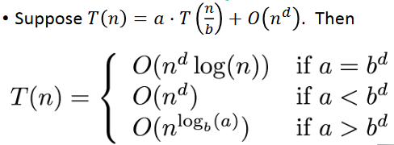
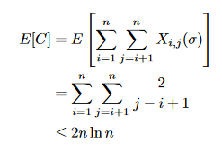

# CS 161 算法设计与分析
**[CS 161 Design and Analysis of Algorithms](https://web.stanford.edu/class/cs161/) **  

## [Lecture 1](https://web.stanford.edu/class/cs161/Lecture1.pdf)
### Karatsuba整数乘法
n位大整数乘法，正常算法需要n平方次乘法和加法运算，现采用分治（Divide and conquer）思想：  
* 将问题分解为更小更容易的子问题
* 二分法：一次n位乘法 -> 分解为4次(n/2)位乘法
* 通过ad+bc=(a+b)(c+d)-ac-bd使得计算次数减为3次
* 3^(log2(3)) 约等于 n^1.6 < n^2

## [Lecture 2](https://web.stanford.edu/class/cs161/Lecture2.pdf)
### Part 1 排序算法
#### 插入排序
```
# 伪码如下：
InsertionSort(A):    
	for i in [1:n]
		current ← A[i]
		j ← i-1
	while j >= 0 and A[j] > current:
		A[j+1] ←A[j]
		j ← j-1
	A[j+1] ← current
```
复杂度分析：外层n次循环，内层最坏情况下也需要n次循环，因此复杂度是n^2。
#### 合并排序
```
#伪码如下
MERGESORT(A):
    n ← length(A)
    if n ≤ 1:
        return A
    L ← MERGESORT(A[0 : n/2])
    R ← MERGESORT(A[n/2 : n])
    return MERGE(L,R)
```
复杂度分析：分解问题log(n)层，每层合并已排序数组11n(11次操作)，合计nlog(n)

### Part 2 如何估计算法的运行时间
#### 最坏情况分析
使用原因：  
* 我们不知道什么情况最好（不知道平均的输入模式是什么）
* 时间往往由最坏的情况决定  

#### 时间分析
一种算法运行得更快意味着在相同大小的输入下花费更少的时间。从硬件和语言问题中抽象出来，但是只关注n很大的情况。  
大O标记法：O(...)意味着上界，Ω(...)意味着下界，Θ(...) 均是。

## [Lecture 3](https://web.stanford.edu/class/cs161/Lecture3.pdf)
### 递归关系
#### Master Method
  
* a: 子问题的数目
* b: 输入缩小的因子
* d: 创建所有子问题并合并他们的解所需要的工作  
在递归关系中常常忽略向上/向下取整。

#### Substitution Method
* 猜测答案
* 证明猜测  
类似于数学归纳法。  

### 例子：寻找中间数值的新算法
问题：从长度n的数组中找到第k小的元素。  
```
Select(A,k): 
    p = getPivot(A)
    L, pivotVal, R = Partition(A,p)
    if len(L) == k-1:
    	return pivotVal
    Else if len(L) > k-1:
    	return Select(L, k)
    Else if len(L) < k-1:
    	return Select(R, k –len(L) –1)
```
T(n) <= max{T(|L|), T(|R|)} + O(n)。  
**在理想情况下**，输入将划分为相同长度的两份，因此len(L) = len(R) = (n-1)/2，利用Master Theorem得到T(n) <= O(n)。  
**选择Select(A,n/2)作为中位数**，使用子数组的中位数的中位数作为近似值代替。例如将A划分成五份数组，取它们的中位数形成新数组，再取其中位数作为分割数。可以证明|L|,|R|<=7/10*n+5。  

## [Lecture 4](https://web.stanford.edu/class/cs161/Lecture4.pdf)
### 快速选择——随机选择基准值
randomPivot(len(A))返回一个随机的位置，如何计算运行时间：  
* 如果3n/10 < len(L) < 7n/10，那么基准值是“好的”
* 选中一个好的基准值的可能性：0.4
* 直到找到好的基准值需要尝试2.5次
* 所做的工作应该是2.5*Θ(n)=Θ(n)  
根据Master Theorem得到时间复杂度为O(n).  

### 分析随机化的算法
预期运行时间与最坏情况运行时间

### 随机化的排序算法
#### BogoSort(教学性质)
```
BogoSort(A):
    While true:
        Randomly permute A.
        Check if A is sorted.
        If A is sorted, return A
```
* 预期运行时间：Θ(n*n!)
* 最坏情形运行时间：无穷大（可能永远跑不出结果）

#### QuickSort（重要）
```
QuickSort(A):
    If len(A) <= 1:
        return 
    Pick some x = A[i]
    PARTITION the rest of A into: 
        L (less than x) and 
        R (greater than x)
    Replace A with [L, x, R]
    QuickSort(L) 
    QuickSort(R) 
```
运行时间分析：T(n)  = T(|L|) + T(|R|) + Θ(n)，在基准值精确地将待排序数组分成两半的情况下，T(n) = 2\*T(n/2) + O(n)，所以T(n) = O(n\*log(n))。最坏情况下基准值恰好是最大/最小值，T(n) = T(n-1) + O(n)，所以T(n) = n^2。  
比较次数分析： 
  
实现：随机选择一个基准值移至最后一个，使用两个指针从前向后扫描，遇到小于等于基准值的就交换至指针前面，重复这一过程。

|比较|快速排序|合并排序|
|:---|:---|:---|
|运行时间|最坏：O(n^2)</br>期望：O(n\*log(n))|最坏：O(n\*log(n))|
|使用|Java的基础类型，C-qsort，Unix，g++|Java对象，Perl|
|原地替换|是|否|
|稳定|否|是|
|备注|适合数组|适合链表|

## [Lecture 8](https://web.stanford.edu/class/cs161/Lecture8.pdf)
### Graphs 图
#### 基本概念
有向图、无向图、顶点、边

#### 图的表示方法
|比较|邻接矩阵|链表|
|:---|:---|:---|
|存在边|O(1)|O(deg(v)) or O(deg(w))|
|相邻顶点|O(n)|O(deg(v))|
|空间使用|O(n2)|O(n + m)|

### DFS 深度优先搜索
每个顶点需要跟踪状态和进出的时间
```
DFS(w, currentTime):
  w.startTime = currentTime
  currentTime ++
  Mark w as IN_PRIGRESS
  for v in w.neighbors:
    if v is UNVISITED:
      currentTime = DFS(v, currentTime)
      currentTime++
  w.finishTime = currentTime
  Mark w as ALL_DONE
  return currentTime
```
应用：拓扑排序、BST遍历

### BFS 广度优先搜索
```
Set L(i) = [] for i=1,...,n
L(0) = {w}
For i= 0, ..., n-1:
  For u in L(i):
    For each v which is a neighbor of u:
      If v isn’t yet visited:
        mark v as visited
        put it in L(i+1)
```
应用：计算顶点对之间的距离（求最短距离）

### 强连通分量
* DFS创建一个DFS森林
* 反转所有边
* 再次使用DFS创建一个DFS森林
* SCC是此时森林中不同的树